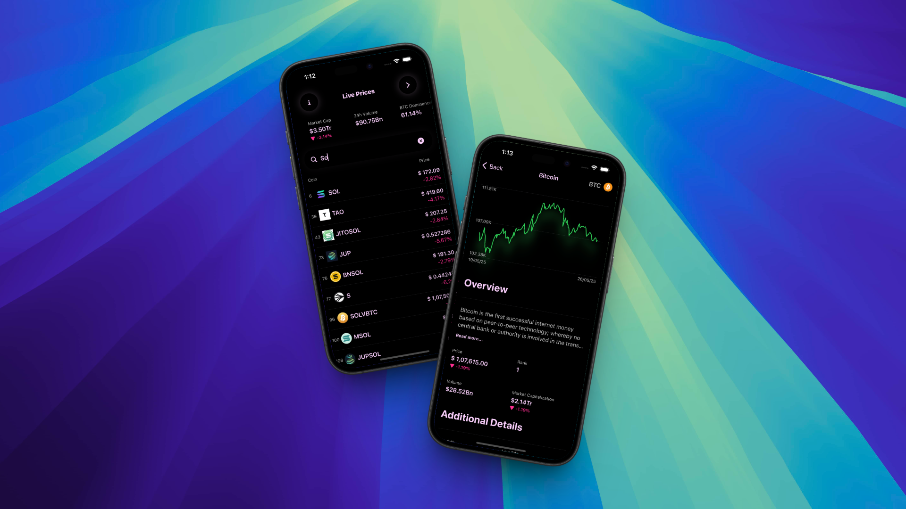

  <h1>Ledger</h1>

  

A modern cryptocurrency portfolio management app for iOS, built using SwiftUI with MVVM architecture. Track, save, and manage your crypto investments with real-time market data from CoinGecko API.

## Requirements
- iOS 15.0+
- Xcode 13.0+
- Swift 5.5+

## Getting Started
1. Clone the repository
2. Open `CryptoTracker.xcodeproj` in Xcode
3. Build and run the project

## License
This project is licensed under the MIT License - see the LICENSE file for details.